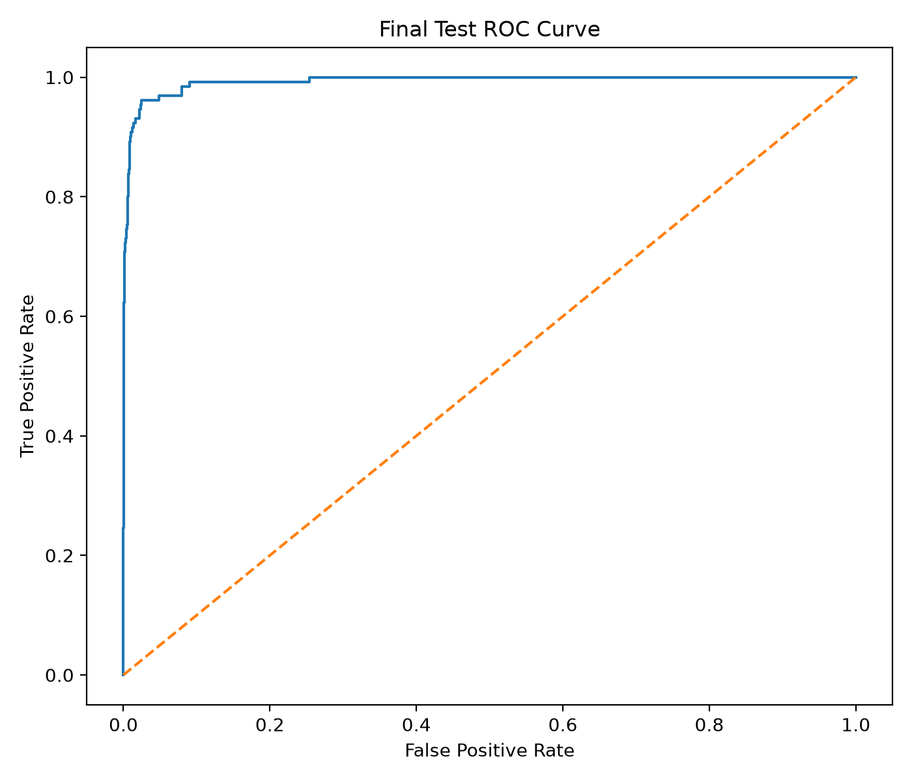
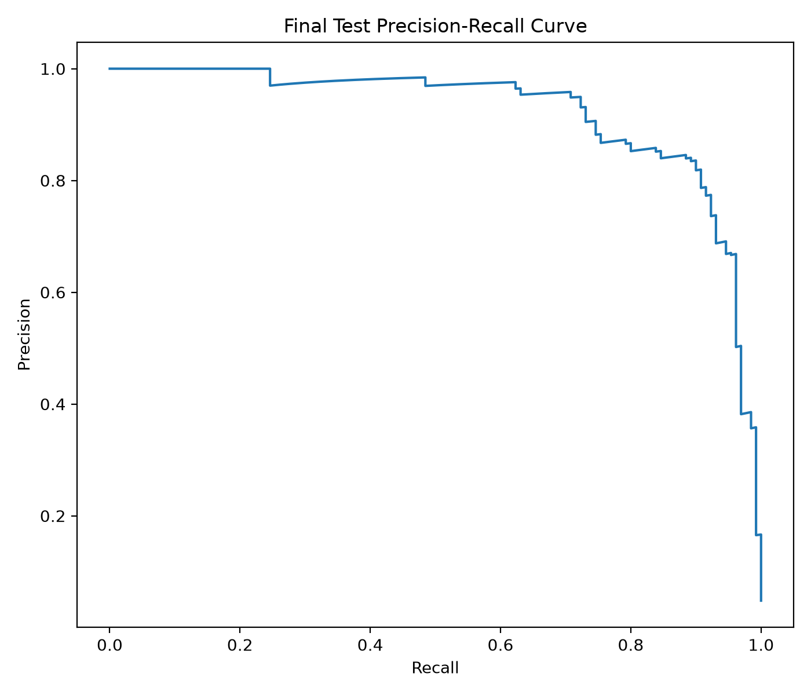
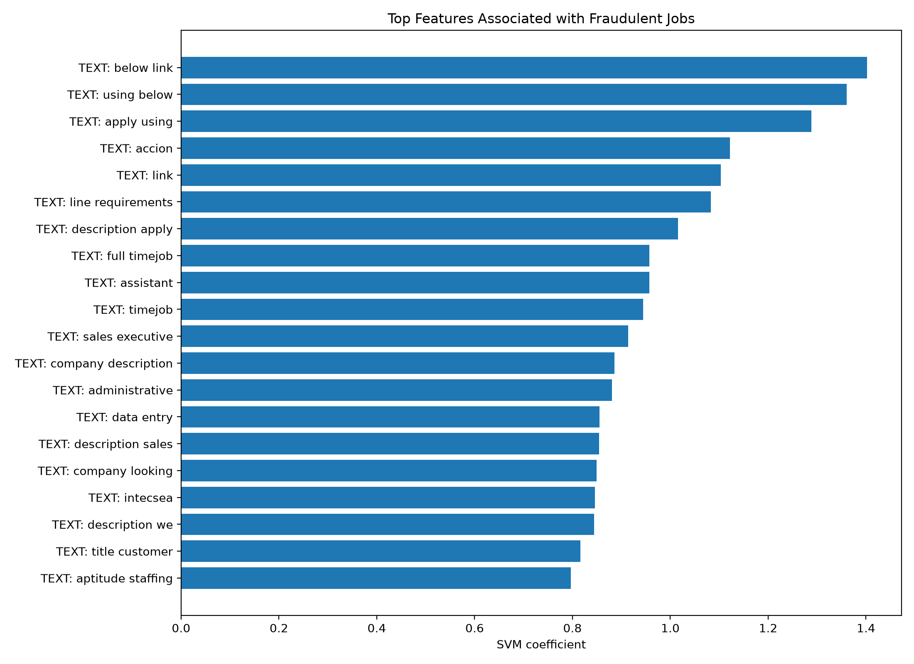

# 🛡️ InternSafe AI

## AI-powered Job Fraud Detection System

InternSafe AI is an intelligent recruitment fraud detection platform using Machine Learning and Explainable AI.

The system analyzes:

- Job description content
- Company information
- Recruitment metadata
- Suspicious hiring patterns

## 🚀 Live Demo

https://your-demo-link

## ⭐ Key Features

### Fraud Risk Prediction

Three-level classification:

🟢 LOW RISK

🟡 NEEDS REVIEW

🔴 HIGH RISK

### Explainable AI

The system explains:

- Why a job is suspicious
- Which features increase fraud probability
- Which signals indicate safety

### Machine Learning Model

Model:

- TF-IDF NLP
- Metadata features
- Linear SVM
- Probability Calibration

## 📊 Performance

| Metric | Score |
|---|---:|
| ROC-AUC | 99.31% |
| PR-AUC | 92.15% |
| Fraud Recall | 92.31% |
| F1-score | 83.33% |

## 🏗️ System Architecture

User

↓

Frontend (HTML/CSS/JS)

↓

FastAPI Backend

↓

Feature Engineering

↓

Machine Learning Model

↓

Risk Explanation

## 🛠️ Technology

Python

FastAPI

Scikit-learn

Pandas

NumPy

TF-IDF

SVM

## ⚠️ Disclaimer

InternSafe AI provides risk assessment support only.
It does not make legal conclusions about any company or individual.

## Model Evaluation

### ROC Curve

### Precision Recall Curve

### Explainable AI Features

